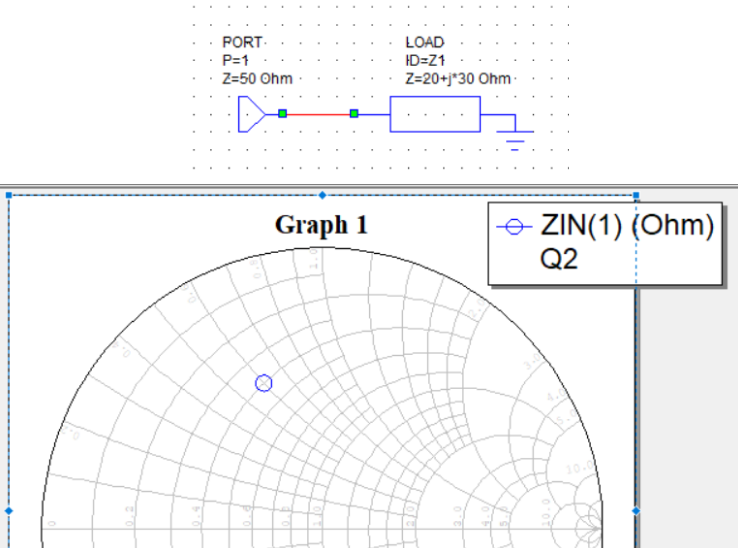
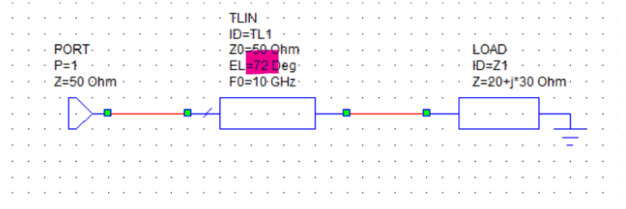

# -different-stub-matching-awr-simulations
in this tutorial single stub and double stub with added load line section will be investigated using AWR software
   
first we will examine single stub matching using awr software with an example and then we will have an analysis on double stub matching using another example . 
apart from the mothod explanation we will find four values :
- bandwidth using an ideal load (single stub matching)
- bandwidth using capacitor and inductor as load (single stub matching)
- bandwidth using an ideal load (double stub matching)
- bandwidth using capacitor and inductor as load (double stub matching)
## single stub mathing
we will solve this question for clarification of this method in 2G hz frequency : 

  

in single stub matching our goal is to find to parameters : 
1. the length which the stub is located (distance from load)
2. the length of the stub

so how do we solve this problem using awr ? 
first we make a plot of the input impedance and we change the length of the transmission line until we reach g=1 circle : 

  

Now we see that the susceptance is –1.06068, which needs to be compensated with a susceptance of +1.06068. A parallel short-circuited stub can provide pure susceptance, making it a convenient solution.
so we change the schematic and reach the center using a parallel short circuit stub.

  

  

### bandwidth using an ideal load (30+40j)

  

- bandwidth : 324 Mhz

### bandwidth using capactor and inductor 
now i replaced the 30+40j with resistance and inductor to represent 30+40j in 10Ghz. our conclusion is that the bandwidth decreases in this case.

  

  

- bandwidth : 324 Mhz

bandwidth conparison : 
| ideal load | resistance and inductor|
|------------|------------------------|
|  403 Mhz   |         324 Mhz        |

## double stub mathing
utilizing the previous method we can match any finite load with the characteristic resistance of a line. but there is a problem that i want to address. the stub is connected to the line at a specific point and if we change the impedance of the load, the connection point needs to change and it is hard build a variable length coaxial line but changing the length of a short circuited stub is easy. (a very simple method is to short circuit the stub at a desired location using some wires !)  
So the idea is tho perform the matching using two short circuited stubs. The advantage of this approach is that the connection points are fixed and by changing the length of this two stubs we can match any finite arbitrary load with the characteristic impedance of the line.  
lets use this method to find the solution for this question in 2Ghz:    

  

if you want to solve this problem using double stub matching you need to solve the transmission line from the end and the biginning simultaneously.(this will be clarfied later)
lets start from the beginning draw the load and then rotate it around the center to apply the transmission line effect 
load:  

  

load rotation :   

  
  

now lets start from the end. It needs to be on g=1 circle at the end of line befor adding the susceptance. so we draw the g=1 circle and rotate it clockwise(0.25 λ  ) 
the left one shows g=1 and the right picture shows the rotated one.

  
  

This means that after the first parallel stub, we must lie on this circle. Therefore, we need to add enough susceptance to Zin(after the 72° series transmission line) so that it falls on this circle. Naturally, there are infinitely many lengths for this purpose, but we choose the minimum possible length. 

  

Now the only remaining task is to move from g=1 to the center of the circle, which we do with a parallel stub. By tuning, we can find a stub length that accomplishes this. This has been done, and the complete circuit at 10 GHz is shown below.

  

and the result demonstrates that our approach was correct :   

  

now we will find the real bandwidth by replacing the ideal load with a resistance and inductor (you need to find the inductance that Lω = 30 in 10Ghz which is 0.477nH):  

  

which you can draw the result in a rectangular plot :  

  

- bandwidth : 179.1 Mhz
